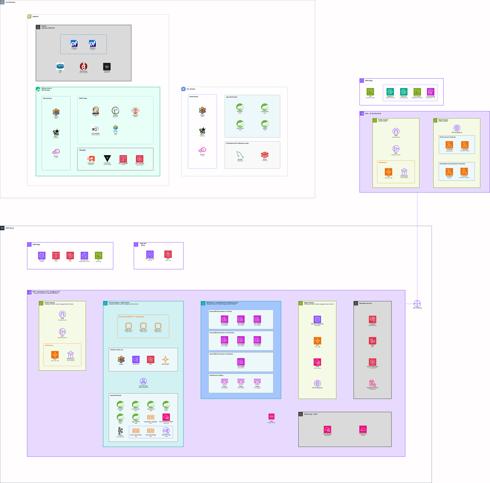
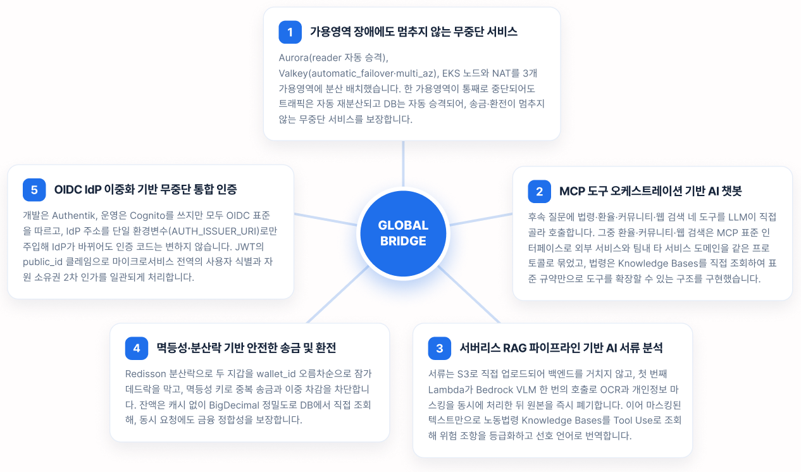
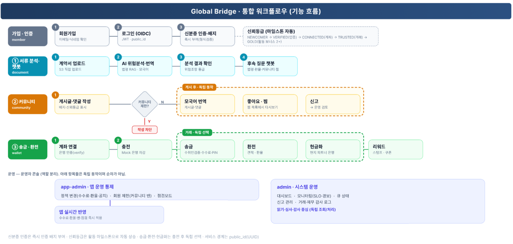

# [우리FISA 6기] 클라우드 엔지니어링 과정 상암 비버즈 · Global Bridge

본 문서는 외국인 근로자를 위한 클라우드 금융 플랫폼 **Global Bridge**의 프로젝트 산출물입니다. 온프렘과 AWS를 동일한 표준으로 구축한 운영급 고가용성 인프라 위에 송금, 환전, AI 서류 분석, 커뮤니티 서비스를 제공합니다.

## 1. 프로젝트 개요

* **주제**: Global Bridge. 외국인 근로자를 위한 클라우드 금융 플랫폼으로, 송금 및 환전 전자지갑, AI 서류 분석, 커뮤니티 기능을 단일 플랫폼으로 통합 제공합니다.s
* **프로젝트 기획 배경**: 국내 체류 외국인 근로자는 약 110만 명에 이르며, 복잡하고 비용이 높은 해외송금, 이해하기 어려운 한국어 계약서, 부족한 생활 및 비자 정보라는 공통의 어려움을 겪고 있습니다. 본 팀은 이러한 문제의 본질을 ‘신뢰’로 정의하였으며, 고객의 신뢰와 수익을 지속적으로 보장하기 위해서는 중단 없이 안전한 인프라가 전제되어야 한다고 판단하였습니다. 이에 고가용성을 설계의 출발점으로 설정하고, 온프렘 환경과 AWS를 동일한 빌딩블록으로 구축한 기반 위에 금융 서비스를 구현하였습니다.
* **기술 스택**
    * **Backend**: Java 17, Spring Boot 3.5, MySQL 8.0, Redis 및 Valkey(Redisson 분산락), Apache Kafka, Micrometer 및 Prometheus
    * **Frontend**: React 19, TypeScript, Vite
    * **AI (서버리스)**: Python 3.12, AWS Lambda, Amazon Bedrock(Claude Sonnet), Bedrock Knowledge Bases(S3 Vectors), SQS, DynamoDB, MCP
    * **Cloud (AWS 단일 계정)**: EKS, Aurora MySQL, ElastiCache(Valkey), CloudFront 및 WAF, API Gateway, ALB, Cognito, KMS, CloudTrail, Pod Identity
    * **On-prem**: vSphere(CPI 및 CSI), Rocky Linux 9 Kubernetes, Cilium(eBPF 및 Hubble), pfSense(CARP HA), Vault(Raft 3노드), Authentik(SSO), Harbor
    * **IaC 및 DevOps**: Terraform, Jenkins, SonarQube, Kaniko, Harbor, ArgoCD(GitOps), Helm, External Secrets(ESO), Tailscale 및 WireGuard, FRR BGP

## 2. 아키텍쳐

### 2-1. 시스템 아키텍쳐



### 설명

온프렘 개발 환경과 AWS의 두 VPC(운영·스테이징 VPC, AI 분석 전용 VPC)를 VPC Peering과 WireGuard 터널로 연결한 하이브리드 구조입니다. 온프렘과 AWS는 양쪽 퍼블릭 서브넷의 WireGuard EC2(ASG 자가복구)와 FRR(BGP)로 사이트 간 연결되며, 개발자 원격 접속은 Tailscale 메시로 보완합니다.

온프렘은 vSphere 위에 구성하였습니다. pfSense를 CARP HA(Active/Standby)로 이중화하여 게이트웨이로 두고, Rocky Linux 9 Kubernetes 클러스터에 GitOps 도구(Jenkins·Harbor·ArgoCD·SonarQube·Trivy), 보안(Authentik SSO·Vault HA·cert-manager·ESO), Cilium(eBPF)·Envoy 네트워킹을 올렸습니다. 별도 Dev 클러스터에는 member·community·document·wallet 서비스와 MySQL·Redis를 띄워 비용 효율적인 개발기로 사용합니다.

AWS 운영·스테이징 VPC는 각각 3개·2개 가용영역에 분산했습니다. Route53·ACM·CloudFront·WAF 엣지와 API Gateway를 거쳐 Private Subnet의 EKS 클러스터(ASG 3~9 노드, 다중 AZ)로 트래픽이 들어가며, Cilium·ALB Controller·ESO·Cluster Autoscaler 위에서 member·community·document·wallet·admin·app-admin 서비스와 MCP 서버(mcp-community·mcp-exchange, Internal NLB), exchange-updater, Kafka, Prometheus·Grafana·YACE 모니터링이 동작합니다. 데이터 계층은 도메인별로 분리한 Aurora Serverless v2 세 클러스터(Core·Content·Admin, writer/reader 다중 AZ)와 ElastiCache Valkey(3-AZ)로 구성하고, Cognito·KMS·Secrets Manager·Parameter Store(관리형)와 CloudWatch·CloudTrail(관측·감사)을 함께 둡니다.

AI 분석 전용 VPC(10.110.0.0/16)는 VPC Peering으로 운영 VPC와 연결되며, Lambda(서류 추출·분석, 챗봇, 커뮤니티 번역)가 Bedrock(Claude·Knowledge Bases·S3 Vectors)과 DynamoDB·S3를 사용해 AI 서류 분석과 챗봇을 수행하고, 분석 결과는 SQS로 운영 백엔드에 전달합니다. 전 구간은 4계층 서브넷(public·private·db·mgmt)으로 격리하고 Terraform(IaC)과 GitOps로 관리합니다.

### 2-2. 소프트웨어 아키텍처


### 설명

도메인 단위로 분리한 MSA를 접속 단말기부터 실행 환경까지 7개 계층으로 쌓은 계층형(Layered) 구조입니다(상세 계층은 위 다이어그램 참고). 모든 계층은 Spring Security OAuth2 및 JWT 기반의 통합 인증·권한과 로그·감사가 공통으로 관통합니다.

각 서비스는 Controller, Service, Repository, DTO의 계층형으로 구현하였고, 서비스 경계를 넘는 회원 참조는 물리 FK 없이 `public_id`(UUID)로만 수행하며, 도메인 간 비동기 통신은 Kafka 이벤트로 처리합니다. 3-tier(개발 온프렘 / 스테이징·운영 AWS)는 동일한 코드를 환경변수로만 분기하여 운영합니다.

## 3. 주요 기능 소개

### 3-1. 핵심 기술 구성



본 프로젝트의 차별화된 핵심 기능은 다음 다섯 가지입니다. 첫째 가용영역 장애에도 멈추지 않는 무중단 서비스, 둘째 MCP 도구 오케스트레이션 기반 AI 챗봇, 셋째 서버리스 RAG 파이프라인 기반 AI 서류 분석, 넷째 멱등성 및 분산락 기반의 안전한 송금 및 환전, 다섯째 OIDC IdP 이중화 기반의 무중단 통합 인증입니다.

### 3-2. 통합 워크플로우 다이어그램



### 설명

가입·인증(회원가입 → 로그인 → 신분증 인증 → 신뢰등급)을 공통 출발점으로, 세 갈래 사용자 기능과 운영자 기능이 어떻게 연결되어 동작하는지를 정리한 다이어그램입니다. 로그인 후에는 미인증 상태에서도 ① AI 서류 분석·챗봇과 ② 커뮤니티를 이용할 수 있고, 신분증 인증(KYC)을 완료하면 ③ 송금·환전이 열립니다.

인증 배지는 형식 검증 통과 시 즉시 부여되고 신뢰등급은 활동 마일스톤(인증·계좌·거래·보너스)으로 NEWCOMER부터 GOLD까지 자동 상승하며, 송금·환전·현금화와 커뮤니티의 부가 동작은 각각 독립적으로 선택됩니다. 운영자 콘솔은 app-admin(정책·회원 제한·점검의 앱 실시간 반영)과 admin(인프라·수익 모니터링·커뮤니티 삭제·감사)으로 역할이 분리됩니다.

### 3-3. 세부 기능 소개

#### [기능 1] 가용영역 장애에도 멈추지 않는 무중단 서비스

* **기능 설명**: Aurora(reader 자동 승격), ElastiCache(Valkey, `automatic_failover`·`multi_az`), EKS 노드와 NAT를 3개 가용영역에 분산 배치하였습니다. 한 가용영역이 통째로 중단되어도 트래픽은 자동 재분산되고 데이터베이스는 자동 승격되어, 고객의 송금과 환전이 멈추지 않는 무중단 서비스를 보장합니다.
* **핵심 코드(스크립트)**:
```hcl
# modules/elasticache/main.tf : 노드 2개 이상이면 다중 AZ 자동 페일오버를 활성화
resource "aws_elasticache_replication_group" "this" {
  engine                     = "valkey"
  num_cache_clusters         = var.node_count            # primary 1 + replica(node_count-1)
  automatic_failover_enabled = var.node_count > 1
  multi_az_enabled           = var.node_count > 1
}
```
```hcl
# modules/aurora/main.tf : writer/reader 다중 인스턴스, 마스터 비밀번호는 AWS가 관리(state 미저장)
resource "aws_rds_cluster" "this" {
  engine                      = "aurora-mysql"
  manage_master_user_password = true
  storage_encrypted           = true
}
# instance_count = 1 → writer만, 2 이상 → writer + reader(자동 승격 대상)
resource "aws_rds_cluster_instance" "this" { count = var.instance_count }
```
* **코드 링크**: [modules/elasticache/main.tf](https://github.com/{ORG}/cloud-infra-iac/blob/main/modules/elasticache/main.tf), [modules/aurora/main.tf](https://github.com/{ORG}/cloud-infra-iac/blob/main/modules/aurora/main.tf)

#### [기능 2] MCP 도구 오케스트레이션 기반 AI 챗봇

* **기능 설명**: 분석 결과에 대한 사용자의 후속 질문에는, 법령 Knowledge Bases와 환율, 커뮤니티, 웹 검색(Tavily) 네 개 도구를 LLM이 직접 선택하여 호출함으로써 응답합니다. 그중 환율·커뮤니티·웹 검색은 MCP 표준 인터페이스로 외부 서비스(Tavily)와 사내 타 서비스 도메인(환율·커뮤니티)을 동일한 프로토콜로 결합하였고, 법령은 Knowledge Bases를 직접 조회하여 표준 규약만으로 도구를 확장할 수 있는 구조를 구현하였습니다.
* **핵심 코드(스크립트)**:
```python
# src/chatbot.py : Bedrock converse_stream의 stopReason이 tool_use면 도구 실행 후 루프 지속
if stop_reason == "tool_use":
    for cb in content_blocks:
        if cb["type"] == "toolUse":
            result_text = execute_tool(cb["name"], cb["input"])   # 도구 4종 중 LLM 선택
            tool_results.append({"toolResult": {
                "toolUseId": cb["toolUseId"], "content": [{"text": result_text}]}})
    messages.append({"role": "user", "content": tool_results})
    continue
```
```python
# src/tools.py : 외부 Tavily Remote MCP에 mcp SDK Streamable HTTP 클라이언트로 직접 연결
async with streamablehttp_client(url, headers=headers) as (read, write, _):
    async with ClientSession(read, write) as session:
        await session.initialize()
        result = await session.call_tool(
            "tavily_search", arguments={"query": query, "max_results": max_results})
```
* **코드 링크**: [gb-chatbot-lambda/src/chatbot.py](https://github.com/{ORG}/gb-chatbot-lambda/blob/main/src/chatbot.py), [src/tools.py](https://github.com/{ORG}/gb-chatbot-lambda/blob/main/src/tools.py), [src/app.py (SSE)](https://github.com/{ORG}/gb-chatbot-lambda/blob/main/src/app.py)

#### [기능 3] 서버리스 RAG 파이프라인 기반 AI 서류 분석

* **기능 설명**: 근로계약서와 급여명세서는 클라이언트가 S3 Pre-signed URL로 직접 업로드하여 백엔드 서버를 경유하지 않습니다. 첫 번째 Lambda가 Bedrock Claude VLM 단일 호출로 OCR 추출과 개인정보 마스킹을 동시에 처리한 직후 원본 이미지를 즉시 폐기하므로, 평문 개인정보는 저장되지도 분석 단계로 전달되지도 않습니다. 이어 두 번째 Lambda가 마스킹된 텍스트만을 입력으로 한국 노동법령을 벡터화한 Knowledge Bases를 Tool Use로 조회하여 위험 조항을 등급화하고 선호 언어로 번역합니다.
* **핵심 코드(스크립트)**:
```python
# lambda_a/handler.py : Bedrock Vision 1회로 추출 및 마스킹 후 원본 바이트를 즉시 소멸
def _extract_and_mask(bucket, key):
    obj = s3.get_object(Bucket=bucket, Key=key)
    raw_bytes = obj["Body"].read()
    content_block = _build_content_block(raw_bytes, key)
    resp = bedrock.converse(
        modelId=MODEL_ID,
        messages=[{"role": "user", "content": [content_block, {"text": EXTRACT_MASK_PROMPT}]}],
        inferenceConfig={"maxTokens": MAX_TOKENS, "temperature": 0})
    del raw_bytes          # 원본 바이트 즉시 소멸 (PII 2단계)
    return _split_verdict(_converse_text(resp))
```
```python
# lambda_b/handler.py : Tool Use 루프에서 법령 KB(S3 Vectors)를 retrieve로 조회 (RAG)
for tu in tool_uses:
    if tu["name"] == "get_legal_standard":
        text = _kb_lookup(tu["input"].get("query_text", ""))
        tool_results.append({"toolResult": {"toolUseId": tu["toolUseId"], "content": [{"text": text}]}})

def _kb_lookup(query_text):
    res = bedrock_kb.retrieve(
        knowledgeBaseId=KB_ID,
        retrievalQuery={"text": query_text},
        retrievalConfiguration={"vectorSearchConfiguration": {"numberOfResults": KB_NUM_RESULTS}})
    return "\n---\n".join(r["content"]["text"] for r in res.get("retrievalResults", []))
```
* **코드 링크**: [gb-document-lambda/lambda_a/handler.py](https://github.com/{ORG}/gb-document-lambda/blob/main/lambda_a/handler.py), [lambda_b/handler.py](https://github.com/{ORG}/gb-document-lambda/blob/main/lambda_b/handler.py)

#### [기능 4] 멱등성 및 분산락 기반 안전한 송금 및 환전

* **기능 설명**: 동시에 다수의 송금 요청이 발생하는 상황에서도 잔액 정합성이 보장되도록, Redisson 분산락으로 두 지갑을 `wallet_id` 오름차순으로 잠가 데드락을 방지하고, 멱등성 키로 중복 송금과 이중 차감을 차단합니다. 잔액은 캐시를 거치지 않고 `BigDecimal` 정밀도로 데이터베이스에서 직접 조회하여, 송금과 환전 전 구간의 금융 정합성을 보장합니다.
* **핵심 코드(스크립트)**:
```java
// DistributedLockHelper.java : 두 지갑을 id 오름차순으로 잠그는 MultiLock(데드락 방지)
public RLock tryLockTwoWallets(Long walletIdA, Long walletIdB) {
    long lowerId = Math.min(walletIdA, walletIdB);
    long higherId = Math.max(walletIdA, walletIdB);
    RLock multiLock = redissonClient.getMultiLock(
            redissonClient.getLock(WALLET_LOCK_PREFIX + lowerId),
            redissonClient.getLock(WALLET_LOCK_PREFIX + higherId));
    boolean acquired = multiLock.tryLock(WAIT_TIME_SECONDS, LEASE_TIME_SECONDS, TimeUnit.SECONDS);
    return acquired ? multiLock : null;
}
```
```java
// TransferServiceImpl.java : 멱등성 캐시 적중 시 즉시 반환하고, 락 내부에서만 트랜잭션을 실행합니다.
Optional<TransferExecuteResponse> cached = readFromCache(cacheKey);
if (cached.isPresent()) return cached.get();
RLock lock = distributedLockHelper.tryLockTwoWallets(senderWallet.getId(), receiverWallet.getId());
if (lock == null) throw new BusinessException(CommonErrorCode.SERVICE_UNAVAILABLE);
try { return self.executeInTransaction(...); }
finally { if (lock.isHeldByCurrentThread()) lock.unlock(); }
```
* **코드 링크**: [wallet-service/DistributedLockHelper.java](https://github.com/{ORG}/gb-backend/blob/main/services/wallet-service/src/main/java/com/gb/wallet/global/redis/DistributedLockHelper.java), [TransferServiceImpl.java](https://github.com/{ORG}/gb-backend/blob/main/services/wallet-service/src/main/java/com/gb/wallet/domain/transaction/service/impl/TransferServiceImpl.java)

#### [기능 5] OIDC IdP 이중화 기반 무중단 통합 인증

* **기능 설명**: 개발 환경은 Authentik, 스테이징 및 운영 환경은 Cognito를 사용하지만 두 IdP 모두 OIDC 표준을 따르며, IdP 주소를 단일 환경변수(`AUTH_ISSUER_URI`)로만 주입함으로써 IdP가 교체되어도 인증 코드는 변경되지 않습니다. 또한 JWT의 `public_id` 클레임을 기준으로 마이크로서비스 전역에서 사용자를 식별하고, 자원 소유권에 대한 2차 인가를 일관되게 수행합니다.
* **핵심 코드(스크립트)**:
```java
// SecurityConfig.java : JWKS로 RS256 토큰을 검증만 하고, 공개 경로만 permitAll, 그 외는 인증 필수
http
    .sessionManagement(s -> s.sessionCreationPolicy(SessionCreationPolicy.STATELESS))
    .authorizeHttpRequests(auth -> auth
        .requestMatchers("/swagger-ui/**", "/v3/api-docs/**", "/actuator/**").permitAll()
        .anyRequest().authenticated())
    .oauth2ResourceServer(oauth2 -> oauth2
        .authenticationEntryPoint(authenticationEntryPoint)   // 실패 시 AUTH4011
        .jwt(jwt -> {}));
```
```yaml
# application-stage.yml : IdP(Cognito) 주소를 환경변수로만 주입 (개발은 Authentik issuer-uri)
spring.security.oauth2.resourceserver.jwt.issuer-uri: ${AUTH_ISSUER_URI}
```
```java
// CurrentUserPublicIdArgumentResolver.java : 토큰의 public_id claim에서 본인 식별자 추출
Jwt jwt = jwtAuthentication.getToken();
String userPublicId = jwt.getClaimAsString(CLAIM_PUBLIC_ID);   // "public_id"
if (!StringUtils.hasText(userPublicId)) throw new BusinessException(AuthErrorCode.UNAUTHORIZED);
return userPublicId;
```
* **코드 링크**: [member-service/SecurityConfig.java](https://github.com/{ORG}/gb-backend/blob/main/services/member-service/src/main/java/com/gb/member/global/config/SecurityConfig.java), [CurrentUserPublicIdArgumentResolver.java](https://github.com/{ORG}/gb-backend/blob/main/services/member-service/src/main/java/com/gb/member/global/security/CurrentUserPublicIdArgumentResolver.java), [common-security/RestAuthenticationEntryPoint.java](https://github.com/{ORG}/gb-backend/blob/main/common/common-security/src/main/java/com/gb/common/security/RestAuthenticationEntryPoint.java)
